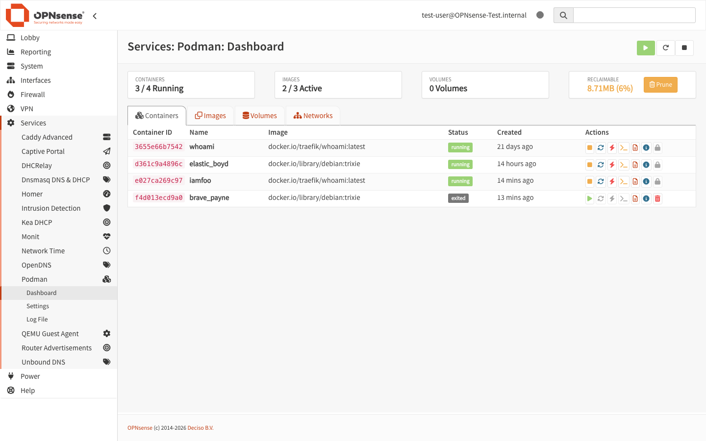
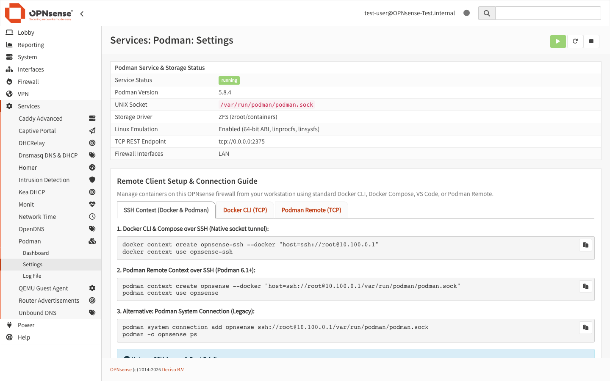
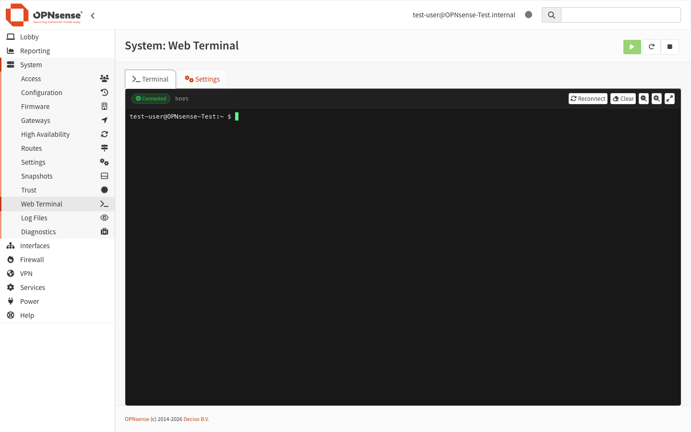
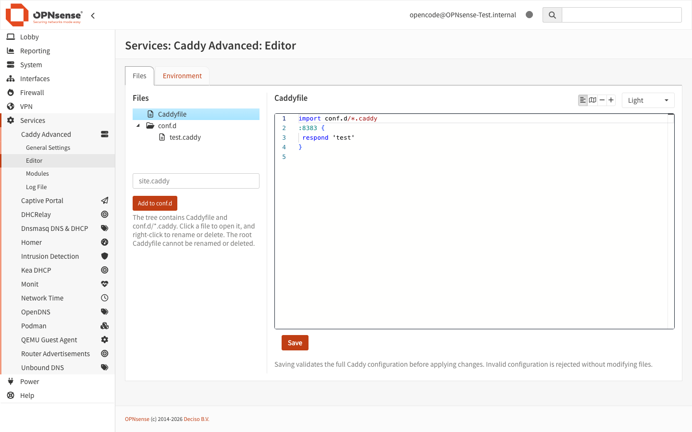
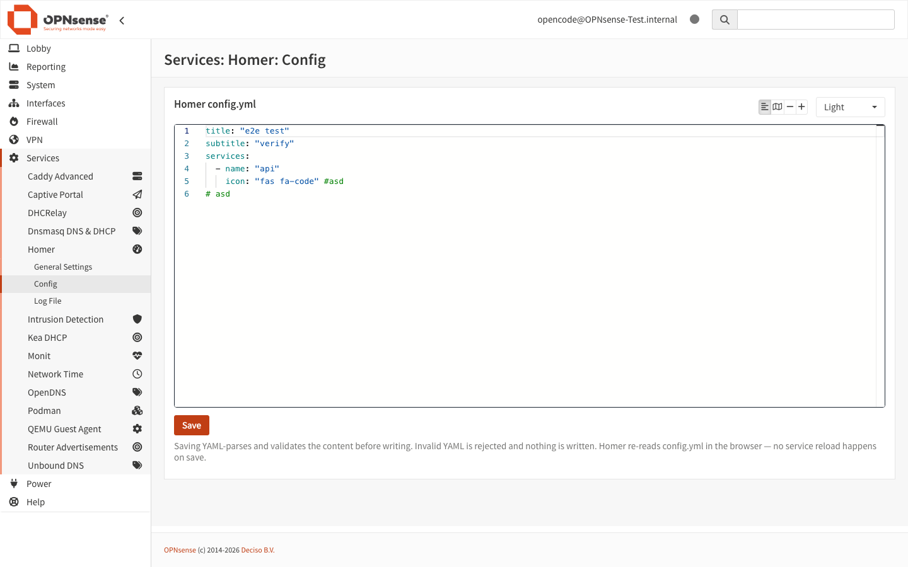

# OPNware

This is my personal OPNsense `pkg` repository.\
It provides custom OPNsense plugins and FreeBSD packages that I use on my firewalls:

- **[os-podman](pkgs/os-podman)** — Native OCI container engine on FreeBSD Jails with ZFS storage, Linux emulation, WebUI Dashboard, interactive XTerm.js terminal, structured inspector, container metrics, and remote Docker/Podman context support
- **[os-terminal](pkgs/os-terminal)** — Integrated Web Terminal console for OPNsense with XTerm.js, user privilege drop, shell switcher (synced with user login shell), persistent sessions across navigation, and bash/zsh management
- **[os-caddy-advanced](pkgs/os-caddy-advanced)** — WebUI-managed Caddy web server: process settings, a user-owned Caddyfile editor (validated save cycle, Monaco editor), envfile secrets, and xcaddy module builder
- **[os-homer](pkgs/os-homer)** — Homer dashboard served via its own isolated Caddy instance, automatic TLS, and Monaco YAML editor
- **[monaco-editor](pkgs/monaco-editor)** — Shared Monaco editor assets with custom Caddyfile Monarch syntax grammar
- **[caddy](pkgs/caddy)**, **[xcaddy](pkgs/xcaddy)**, **[yq](pkgs/yq)**, **[bash](pkgs/bash)**, **[zsh](pkgs/zsh)**, **[htop](pkgs/htop)**, **[go126](pkgs/go126)**, and container dependencies (**[podman](pkgs/podman)**, **[ocijail](pkgs/ocijail)**, **[conmon](pkgs/conmon)**, **[containernetworking-plugins](pkgs/containernetworking-plugins)**, **[containers-common](pkgs/containers-common)**, **[gpgme](pkgs/gpgme)**)

---

## 🚀 OPNsense Plugins Showcase

### 1. os-podman (Container Engine & Dashboard)

Run Docker and OCI containers natively on FreeBSD using Podman and `ocijail`:

- **Live Dashboard**: Container lifecycle management (Start, Stop, Restart, Force Kill, Container CLI, Logs, Inspect, Delete), real-time CPU & Memory resource usage indicators, human-readable relative creation timestamps, and safe resource locks.
- **Interactive Container Terminal**: Built-in full-screen capable XTerm.js console attached directly to running containers via WebSocket PTY daemon.
- **Structured Inspector**: Rich inspection modal displaying overview cards (Network/Ports, Bind Mounts, Security/CAPs, Environment, CMD/Entrypoint, Labels) and collapsible Raw Spec with live JSON/YAML toggle.
- **CLI Wrapper & Aliases**: Automatic `podman-wrapper` defaulting image pulls/runs to `linux/amd64`, shell profile integration (`/usr/local/etc/profile.d/podman.sh` & `/etc/csh.cshrc`), Docker CLI symlink (`/usr/local/bin/docker`), and Docker Hub search registry configuration.
- **Storage & Emulation**: Automated ZFS dataset provisioning (`zroot/containers`) and 64-bit Linux kernel emulation (`linux64`, `linprocfs`, `linsysfs`, `fallback_brand=3`).
- **Firewall Integration**: Automatic CNI port forwarding anchor registration (`cni-rdr/*`), outbound container NAT (DNS/Internet access), and interface filtering.
- **Remote Contexts**: Connect directly from your local terminal using `docker context` or `podman --remote` over SSH or TCP/TLS.





---

### 2. os-terminal (Web Terminal Console)

Full-featured interactive terminal console inside the OPNsense WebUI:

- **Authenticated Session**: Automatically logs in as the currently authenticated WebUI user with complete privilege drop.
- **Shell Management**: Easily switch default shell (`csh`, `sh`, `bash`, `zsh`) synchronized with the user's login shell in System: Access: Users.
- **Persistent Sessions**: Terminal history and PTY background daemon keep your session running when switching tabs or navigating away.
- **XTerm.js Console**: Theme-matched OPNsense terminal console with Font Zoom (+/-), Fullscreen mode, and macOS navigation shortcut support (`Cmd+Left/Right`, `Alt+Left/Right`, `Cmd/Alt+Backspace`).
- **One-Click Shell Installation**: Install `bash` and `zsh` packages directly from the plugin settings page.



---

### 3. os-caddy-advanced (Caddy Web Server)

Enterprise-grade reverse proxy and web server with complete configuration flexibility:

- **Split Caddyfile Editor**: Full Monaco code editor with Caddyfile syntax highlighting, toolbar controls (Word Wrap, Minimap, Font Size adjustment), keyboard shortcuts (`Ctrl+S` / `⌘S`), and inline syntax validation before save.
- **File Management**: Manage root `Caddyfile` and modular `conf.d/*.caddy` site configs in a hierarchical tree.
- **Environment & Secrets**: Dedicated environment variable management with masked secrets passed securely via `--envfile`.
- **Custom Modules**: Build custom Caddy binaries on the firewall using `xcaddy` with pinned upstream plugins.



---

### 4. os-homer (Dashboard)

Clean, fast personal dashboard for your network services:

- **Isolated Instance**: Served via its own dedicated, unprivileged Caddy instance (`/usr/local/www/homer`) completely independent of the main web server.
- **Monaco YAML Editor**: Interactive Monaco editor for `/usr/local/www/homer/config.yml` with YAML validation, toolbar toggles, and live theme synchronization.
- **Automatic TLS**: Built-in internal HTTPS certificate minting and configurable bind interfaces.



---

## 📦 Included Packages

| Package | Type | Description |
|---|---|---|
| **os-podman** | Plugin | Native Podman container management, XTerm.js terminal & WebUI dashboard |
| **os-terminal** | Plugin | Interactive Web Terminal console with XTerm.js & shell management |
| **os-caddy-advanced** | Plugin | Advanced Caddy web server & Monaco Caddyfile editor |
| **os-homer** | Plugin | Homer dashboard served via isolated Caddy instance |
| **monaco-editor** | Plugin Asset | Shared Monaco editor assets with Caddyfile Monarch grammar |
| **caddy** | Cross-compiled | Fast, multi-protocol HTTP/1-2-3 web server |
| **podman** | Redistributed | Podman 5.8 container engine for FreeBSD jails |
| **ocijail** | Redistributed | FreeBSD OCI runtime wrapper for jail containerization |
| **conmon** | Redistributed | OCI container monitor |
| **containernetworking-plugins** | Redistributed | Standard CNI plugins (bridge, firewall, host-local, portmap) |
| **containers-common** | Redistributed | Container configuration and registries defaults |
| **xcaddy** | Cross-compiled | Custom Caddy binary builder |
| **yq** | Cross-compiled | Portable command-line YAML/JSON/XML processor |
| **bash** | Redistributed | GNU Bourne-Again Shell |
| **zsh** | Redistributed | Z shell |
| **htop** | Redistributed | Interactive process viewer |
| **go126** | Redistributed | Go 1.26 toolchain |
| **gpgme** | Redistributed | GnuPG Made Easy library |

---

## ⚡ Remote Container Management

Manage containers running on your OPNsense box directly from your workstation:

### Option A: Docker over SSH (Native Socket Tunnel)

```bash
# Create and use a remote Docker SSH context
docker context create opnsense-ssh --docker "host=ssh://root@<opnsense-ip>"
docker context use opnsense-ssh

# Run standard Docker and Compose commands
docker ps
docker compose -f docker-compose.yml up -d
```

### Option B: Podman Remote over SSH

```bash
# Modern Podman context (Podman 6.1+):
podman context create opnsense --docker "host=ssh://root@<opnsense-ip>/var/run/podman/podman.sock"
podman context use opnsense
podman ps

# Alternative (Legacy Podman connection):
podman system connection add opnsense ssh://root@<opnsense-ip>/var/run/podman/podman.sock
podman -c opnsense ps
```

### Option C: Docker REST API over TCP / TLS

When the TCP socket is enabled in **Services: Podman: Settings**:

```bash
export DOCKER_HOST="tcp://<opnsense-ip>:2376"
docker ps
```

---

## 📥 Installation

Open an `ssh` session on your OPNsense/FreeBSD box and run:

```sh
fetch -o /usr/local/etc/pkg/repos/opnware.conf https://mietzen.github.io/OPNware/opnware.conf
pkg update
```

You can now install any package or plugin directly from the WebUI (**System: Firmware: Plugins**) or command line:

```sh
pkg install os-podman os-caddy-advanced os-homer
```

Browse all available packages and versions online at: [https://mietzen.github.io/OPNware/](https://mietzen.github.io/OPNware/)

---

## 🛠️ Why & Architecture

Instead of maintaining a heavy, expensive [FreeBSD poudriere build server](https://github.com/freebsd/poudriere), this repo uses:

- **GitHub Actions** matrix builds for cross-compiling Go binaries and bundling FreeBSD packages.
- **`pkg-tool`** — A custom Python toolchain (`pkg-tool/`) that builds FreeBSD packages (`.pkg`), resolves dependency graphs, validates manifests, and generates signed `packagesite` repository catalogues.
- **GitHub Pages** to host and publish the package repository at 0 cost.

---

## ⚠️ Package Requests? -> Fork It!

**I will NOT accept or respond to package requests.**

This is my **personal** repository provided "as is". If something breaks I will fix it when I get to it, therefore Issues and Discussions are deactivated.

You are welcome to [**fork**](https://github.com/mietzen/OPNware/fork) it and build your own repository. The included GitHub workflows are generic and require only two repository secrets:

- `APP_ID` — GitHub App Client ID
- `APP_PRIVATE_KEY` — GitHub App private key

See the [GitHub App usage guide](https://github.com/actions/create-github-app-token?tab=readme-ov-file#usage) (permissions needed: `Contents: Read/Write`, `Pull requests: Read/Write`).

---

## 💻 Local Build & Repo Preview

Build packages locally without CI environment variables:

```sh
pip install -e "./pkg-tool[dev]"
cd pkgs/os-podman && ./build.sh amd64 15
```

Assemble a preview repository and serve it locally:

```sh
pkg-tool assemble-repo dist config.yml --owner <you> --repo <repo> --output-dir pages
python3 -m http.server 8080 -d pages
```

---

## 📄 License

- **Plugins** (`os-podman`, `os-caddy-advanced`, `os-homer`) are original work of this repository, licensed under the **MIT License**.
- **Vendored assets** (`monaco-editor`) and bundled components retain their respective upstream licenses (**MIT** / **Apache-2.0**).
- **Redistributed packages** retain their original upstream licenses.
